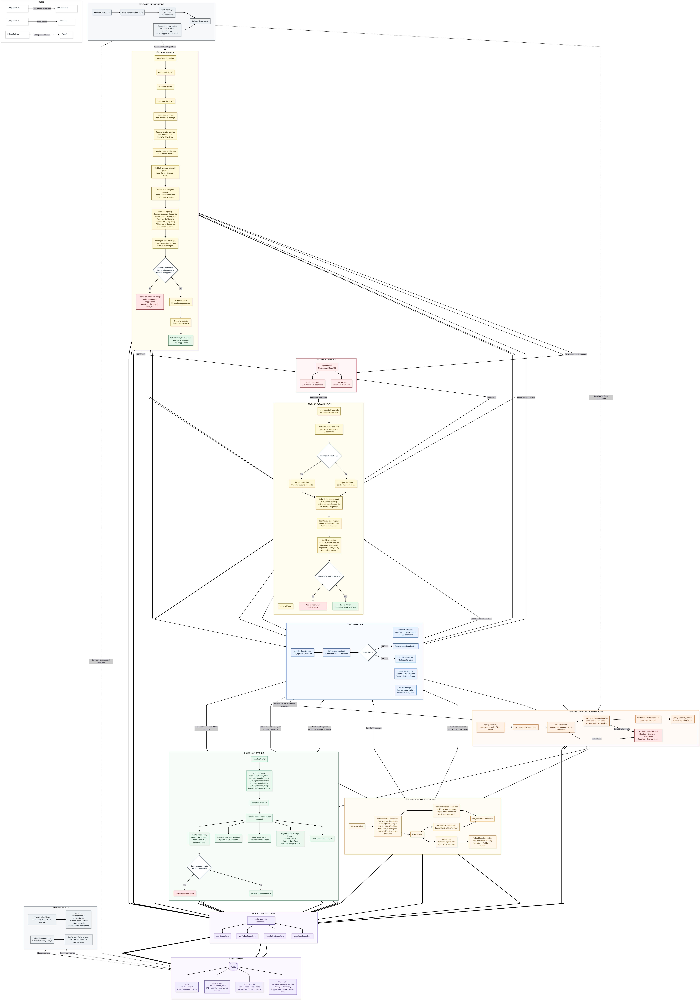

# Mood Tracker

A full-stack mood tracking application built around a Spring Boot REST API. It allows users to record daily mood entries, review trends, and generate AI-assisted summaries, actionable suggestions, and seven-day wellbeing plans.

**Live application:** [moodtracker-app-production.up.railway.app](https://moodtracker-app-production.up.railway.app)

> This project is a portfolio application focused on backend engineering: API design, authentication, persistence, database migrations, external service integration, failure handling, and containerized deployment.

## System Architecture

The following diagram presents the complete application architecture, including authentication, mood tracking, AI analysis, persistence, scheduled maintenance, and deployment.



## Highlights

- Authentication using Spring Security, signed JWTs, and database-backed token validation
- Password hashing with BCrypt, authenticated password changes, and persistent token revocation on logout
- Automatic cleanup of expired authentication tokens every four days
- One mood entry per user per day, enforced at both application and database level
- Paginated mood history with date-range validation
- AI analysis of the most recent 30 days of mood entries
- Language-aware summaries and five practical wellbeing suggestions
- Seven-day plans generated from persisted analysis results
- Resilient OpenRouter integration with timeouts, bounded retries, exponential backoff, and `Retry-After` support
- Structured AI response parsing and validation
- Version-controlled MySQL schema using Flyway
- Multi-stage Docker build with a non-root runtime user
- Environment-based configuration for local and cloud deployments

## Architecture

The backend follows a conventional layered architecture with clear separation between HTTP handling, business logic, persistence, security, and external integrations.

```text
Client
  │
  ▼
Spring Security / JWT filter
  │
  ▼
REST controllers
  │
  ▼
Application services
  ├── User and authentication workflows
  ├── Mood entry business rules
  └── AI analysis and plan generation
  │
  ├──────────────► OpenRouter API
  │
  ▼
Spring Data JPA repositories
  │
  ▼
MySQL / Flyway
```

### Key design decisions

- **Deterministic calculations stay in the application.** The average mood score is calculated in Java; the language model is used only for semantic analysis and text generation.
- **Database constraints protect domain invariants.** A unique constraint on `(user_id, entry_date)` guarantees no duplicate daily entry, including under concurrent requests.
- **AI output is treated as untrusted input.** Responses are extracted from the provider envelope, parsed with Jackson, validated, normalized, and persisted only when usable.
- **External failures are bounded.** AI calls use connect/read timeouts, a maximum number of attempts, capped exponential backoff, and selective retries for transient HTTP failures.
- **Analysis and plan generation are separate workflows.** The latest valid analysis is persisted per user and becomes the input for plan generation.
- **JWTs are verified against server-side state.** Only signed, unexpired, non-revoked tokens registered in the database are accepted. The database stores a SHA-256 token hash rather than the raw JWT.
- **Expired authentication data is removed automatically.** A scheduled cleanup job deletes expired token records every four days.
- **Secrets are externalized.** Database credentials, JWT configuration, and provider credentials are supplied through environment variables.

## Technology Stack

| Area | Technologies |
| --- | --- |
| Language | Java 22 |
| Framework | Spring Boot 3.5, Spring MVC |
| Security | Spring Security, JWT, BCrypt |
| Persistence | Spring Data JPA, Hibernate |
| Database | MySQL, Flyway |
| AI integration | OpenRouter Chat Completions API, Jackson |
| Mapping and boilerplate | MapStruct, Lombok |
| Build | Maven Wrapper |
| Deployment | Docker, Railway |

## Core Workflows

### Daily mood tracking

A user can create one entry per calendar day with a score from 1 to 5 and an optional note. Entries can be updated, queried by date, listed through a paginated range, or deleted.

### AI-assisted analysis

The analysis workflow:

1. Loads the authenticated user's entries from the most recent 30-day period.
2. Sorts and limits the input before sending it to the provider.
3. Calculates the average mood score locally.
4. Requests a language-aware summary and concrete suggestions.
5. Parses and validates the structured response.
6. Creates or updates the user's latest valid analysis.

Example response:

```json
{
  "average": 3.6,
  "summary": "Your recent entries show a generally stable mood with occasional fatigue.",
  "suggestions": [
    "Keep a consistent sleep schedule throughout the coming week",
    "Plan short recovery breaks during demanding working days",
    "Continue recording situations that noticeably affect your energy",
    "Include light physical activity when your schedule allows it",
    "Reflect on positive events before finishing each daily entry"
  ]
}
```

### Seven-day wellbeing plan

The latest persisted analysis is used to generate a practical seven-day plan. The plan adapts its goal according to the calculated average: maintaining beneficial habits for higher averages or suggesting gentle recovery steps for lower averages.

The generated content is intended for general wellbeing support and does not provide medical diagnoses.

## API Overview

All endpoints except authentication routes require:

```http
Authorization: Bearer <jwt>
```

### Authentication

| Method | Endpoint | Description |
| --- | --- | --- |
| `POST` | `/api/auth/register` | Register a user |
| `POST` | `/api/auth/login` | Authenticate and receive a JWT |
| `POST` | `/api/auth/logout` | Revoke the current JWT |
| `GET` | `/api/auth/validate` | Validate the current JWT and return its expiration time |
| `POST` | `/api/auth/change-password` | Change the authenticated user's password |

Login creates an `auth_tokens` record containing the token's SHA-256 hash, JWT ID, owner, expiration time, and revocation status. The raw JWT is not persisted. Logout marks the corresponding record as revoked, and expired records are deleted automatically every four days.

Validate the token when restoring a client session:

```http
GET /api/auth/validate
Authorization: Bearer <jwt>
```

Example successful response:

```json
{
  "valid": true,
  "email": "user@example.com",
  "expiresAt": "2026-08-07T15:00:00Z"
}
```

Missing, unknown, revoked, malformed, or expired tokens receive `401 Unauthorized`. Clients should then remove their locally stored token and redirect the user to the login page.

Change the authenticated user's password:

```http
POST /api/auth/change-password
Authorization: Bearer <jwt>
Content-Type: application/json

{
  "currentPassword": "current-password",
  "newPassword": "new-password"
}
```

The new password must contain between 8 and 72 characters and must differ from the current password.

### Mood entries

| Method | Endpoint | Description |
| --- | --- | --- |
| `POST` | `/api/moods/create` | Create a daily mood entry |
| `PUT` | `/api/moods/update` | Update an entry by date |
| `GET` | `/api/moods/today` | Get today's entry |
| `GET` | `/api/moods/date?date=YYYY-MM-DD` | Get an entry by date |
| `GET` | `/api/moods/range?start=YYYY-MM-DD&end=YYYY-MM-DD` | Get a paginated date range |
| `DELETE` | `/api/moods/delete?id={id}` | Delete an entry |

Pagination parameters supported by the range endpoint include `page`, `size`, and `sort`.

### AI

| Method | Endpoint | Description |
| --- | --- | --- |
| `POST` | `/ai/analyze` | Analyze recent mood entries and persist the result |
| `POST` | `/ai/plan` | Generate a seven-day plan from the latest analysis |

## Project Structure

```text
src
├── main
│   ├── java/com/moodTracker
│   │   ├── config       # HTTP, JSON, security, and persistence configuration
│   │   ├── controller   # REST API layer
│   │   ├── dto          # API and application data contracts
│   │   ├── entity       # JPA entities
│   │   ├── exception    # Domain and API exception handling
│   │   ├── mapper       # MapStruct mappings
│   │   ├── repository   # Spring Data repositories
│   │   ├── security     # JWT handling, filter, and token revocation
│   │   └── service      # Business logic and external AI integration
│   └── resources
│       ├── application.properties
│       └── db/migration # Flyway database migrations
└── test
    └── java             # Automated test source set
```

## Running Locally

### Prerequisites

- Java 22
- Docker, or a locally available MySQL instance

The Maven Wrapper is included, so a separate Maven installation is not required.

### Configuration

The application reads its configuration from environment variables. Export them through your shell or configure them in your IDE. A local `.env` file can be passed to Docker with `--env-file`, but it is not loaded automatically by the application. Never commit real credentials.

Required configuration includes:

```dotenv
SPRING_APPLICATION_NAME=mood-tracker
APPLICATION_TITLE=Mood Tracker
APPLICATION_VERSION=0.0.1
APPLICATION_AUTHOR=Emir Totic

SPRING_DATASOURCE_URL=jdbc:mysql://localhost:3306/mood_tracker
SPRING_DATASOURCE_USERNAME=mood_tracker
SPRING_DATASOURCE_PASSWORD=change-me
SPRING_DATASOURCE_DRIVER_CLASS_NAME=com.mysql.cj.jdbc.Driver

SPRING_JPA_HIBERNATE_DDL_AUTO=validate
SPRING_JPA_SHOW_SQL=false
SPRING_JPA_HIBERNATE_NAMING_PHYSICAL_STRATEGY=org.hibernate.boot.model.naming.CamelCaseToUnderscoresNamingStrategy

SPRING_FLYWAY_ENABLED=true
SPRING_FLYWAY_LOCATIONS=classpath:db/migration
SPRING_FLYWAY_BASELINE_ON_MIGRATE=true

JWT_SECRET=base64-encoded-secret-with-sufficient-length
JWT_EXPIRATION=3600000

OPENROUTER_BASE_URL=https://openrouter.ai/api/v1
OPENROUTER_API_KEY=replace-with-your-key
OPENROUTER_REFERER=http://localhost:8080
OPENROUTER_TITLE=Mood Tracker
OPENROUTER_MODEL=openrouter/free
OPENROUTER_FALLBACK_MODEL=openrouter/free

SERVER_PORT=8080
APP_DOMAIN=http://localhost:5173
```

### Build and run

```bash
git clone https://github.com/emirtotic/mood-tracker.git
cd mood-tracker

./mvnw clean package
./mvnw spring-boot:run
```

Flyway applies the database migrations during application startup. Migration `V6__Create_auth_tokens_table.sql` creates the persistent JWT token store used for validation, revocation, expiration checks, and scheduled cleanup.

## Docker

The Dockerfile uses separate build and runtime stages. The final image contains only the JRE and packaged application, and the process runs as a non-root user.

```bash
docker build -t mood-tracker .

docker run --rm \
  --env-file .env \
  -p 8080:8080 \
  mood-tracker
```

## Engineering Roadmap

The current implementation is a deployed portfolio MVP. The next engineering priorities are:

- Expand automated coverage with unit, MockMvc, repository, and Testcontainers integration tests
- Harden account recovery and resource-ownership authorization
- Add session-management endpoints for viewing and revoking tokens issued to other devices
- Extract the OpenRouter HTTP client, prompt builders, and response validation into dedicated components
- Add Resilience4j circuit breaking, retry jitter, rate limiting, and provider metrics
- Move long-running AI generation to an asynchronous job workflow
- Add OpenAPI documentation and consistent RFC 9457 problem responses
- Introduce analysis history, prompt versioning, selected-model metadata, and token/cost observability
- Add privacy controls for data retention, export, deletion, and AI-provider consent

## Author

**Emir Totić** — Java / Spring Boot backend development | Kafka | Microservices | High-Availability | Payments/Wallet Integrations
